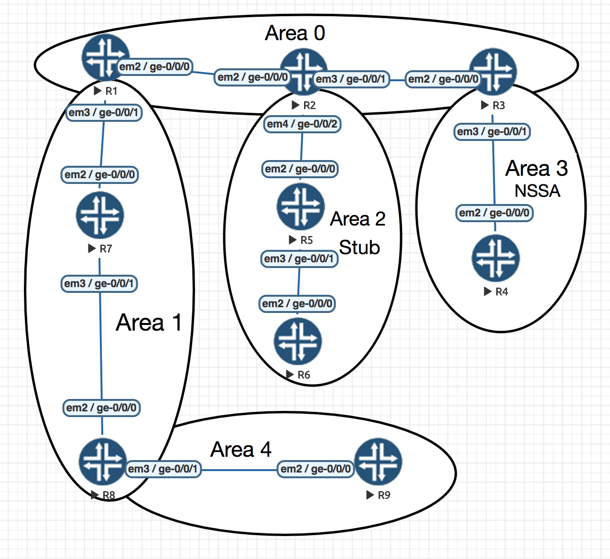

# ospf_jncis

Lab based on JNCIS Study Guide by Joseph M. Soricelli

EVE-NG

vmx-14.1R4.8

## Topology:

### Notes:
* OSPF ABRs never create a network summary LSA to represent a network summary LSA (Virtual Link cenario)
* Stub area -> E bit = 0 (bit 0x0)
* The ABR (with highest router ID) with NSSA LSA with P bit translate LSA Type 7 to LSA Type 5
* Opaque LSA, Link-State ID = Opaque Type (8 bit) + Opaque ID (24 bit)
* Grace LSA: LSA Type 9 (link-local), Opaque Type: 3, Opaque ID: 0.
* Router LSA (type 1): V bit = Virtual Link attached, E bit = ASBR, B bit = ABR
